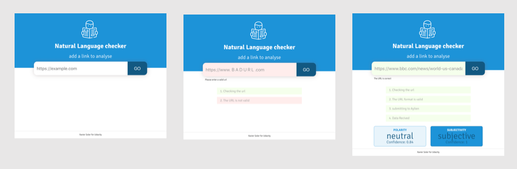

# Evaluate a news article with Natural Language Processing



## Install
Fork, clone, or download this repo to begin the project setup.

 `cd` into the project:

`npm install` to install all the required dependencies.

## Aylien API 

- Go to aylien site [aylien site](https://developer.aylien.com/signup) and sign up for an API key. 

- Create a new  file named `.env` in the root of your project.

- Fill the `.env` file with your API keys like this:

```
API_ID=***********************
API_KEY=**********************
```

## Run Project

### 1. Production Mode
- `npm run build-prod` to generate the distribution folder.
- Production mode can be accessed at `localhost:8081`

### 2. Development Mode
- `npm run build-dev` to start the webpack dev server.
- Development mode can be accessed at `localhost:8080`

**Note: To successfuly run and test development mode, express server should be running.**

### 3. Testing
- `npm run test` to run Jest.